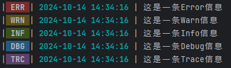

# Logger，一款好看的日志输出包


## 安装

```
go get -u github.com/Zcentury/logger
```


## 使用例子

```go
func main() {
    // 设置日志输出等级
    // PanicLevel < FatalLevel < ErrorLevel < WarnLevel < InfoLevel < DebugLevel < TraceLevel
    // 例如等级为 TraceLevel 就可以输出小于等于 TraceLevel 的所有日志
    // 如果不设置 默认是 InfoLevel
    logger.SetLevel(logger.TraceLevel)
    
    // logger.Panic("这是一条Panic信息，我会导致程序 Panic")
    // logger.Fatal("这是一条Fatal信息，我会导致程序 Fatal")
    logger.Error("这是一条Error信息")
    logger.Warn("这是一条Warn信息")
    logger.Info("这是一条Info信息")
    logger.Debug("这是一条Debug信息")
    logger.Trace("这是一条Trace信息")
}

```

